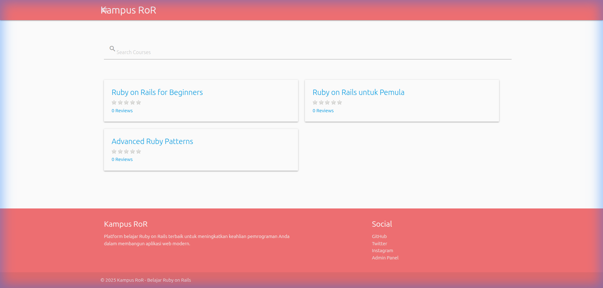
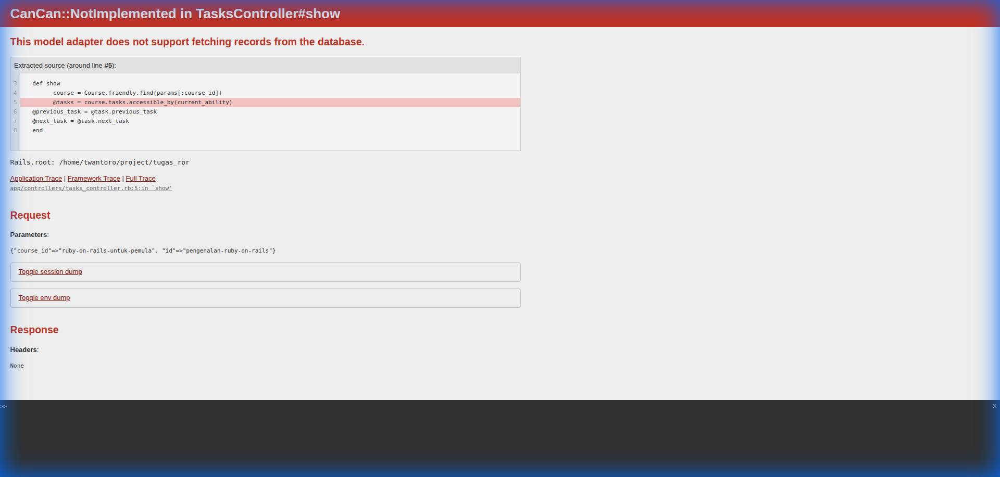

# Kampus RoR: Catatan Perjalanan Belajar Ruby on Rails

Proyek ini merupakan sebuah platform pembelajaran sederhana yang saya bangun sebagai bagian dari proses belajar mandiri menggunakan Ruby on Rails. Di balik setiap baris kodenya, tersimpan cerita tentang usaha, rintangan, dan refleksi dalam menyeimbangkan waktu untuk tumbuh.

## Tentang Proyek Belajar Ini

Kampus RoR lahir dari gairah saya untuk mempelajari teknologi pengembangan web secara lebih mendalam. Sebagai seorang pembelajar, saya ingin menciptakan sesuatu yang nyata—sebuah aplikasi yang dapat mensimulasikan platform kursus daring. Namun, seiring berjalannya waktu, saya dihadapkan pada tantangan yang nyata pula: bagaimana mengelola fokus di tengah tuntutan pekerjaan luring dan rutinitas harian.

Keterbatasan dalam membagi waktu antara kewajiban profesional dan keinginan untuk terus belajar membuat proyek ini sempat terhenti cukup lama. Ia menjadi sebuah tugas yang belum selesai, sebuah pengingat akan pentingnya manajemen prioritas dan disiplin diri yang lebih baik.

## Refleksi Diri

Kini, saat saya melihat kembali kode-kode ini, saya tidak hanya melihat sebuah aplikasi web, melainkan sebuah cerminan perjalanan dari proses belajar yang jujur. Proyek ini mengajarkan saya bahwa pertumbuhan pribadi seringkali tidak berjalan linier. Ada kalanya kita harus berhenti sejenak, mengevaluasi diri, dan mengakui keterbatasan kita.

Revitalisasi proyek ini adalah bentuk komitmen saya untuk tetap melangkah dan menyelesaikan apa yang telah saya mulai, sesederhana apa pun itu. Ini adalah sebuah pengingat yang rendah hati bagi saya untuk selalu memberikan waktu yang cukup bagi setiap proses belajar dan untuk lebih bijak dalam mengatur setiap amanah yang saya jalani.

## Gambaran Aplikasi

Berikut adalah beberapa tampilan dari aplikasi Kampus RoR yang merepresentasikan hasil dari proses belajar ini:

### Halaman Utama
Daftar kursus hasil eksperimen pengembangan saya.


### Halaman Pembelajaran
Ruang untuk mengakses materi video dan melacak progress.


---

## Aspek Teknis (Hasil Pembaruan 2025)

Meskipun merupakan proyek belajar, aplikasi ini telah disesuaikan agar tetap relevan dan stabil:

- **Kerangka Kerja**: Ruby 3.2.3 dan Rails 6.0.6.1
- **Basis Data**: SQLite (Dipilih untuk kemudahan eksplorasi di lingkungan lokal)
- **Fitur yang Diimplementasikan**:
  - Pengelolaan konten melalui panel administrasi sederhana.
  - Alur pendaftaran dan profil pengguna.
  - Pelacakan kemajuan tugas secara mandiri.
  - Integrasi komunikasi waktu nyata dengan ActionCable.

## Cara Menjalankan Aplikasi

1. **Pasang Dependensi**:
   ```bash
   bundle install
   ```
2. **Konfigurasi Environment Variable**:
   Salin file konfigurasi sampel dan sesuaikan dengan kredensial Anda:
   ```bash
   cp config/application.yml.sample config/application.yml
   ```
   Pastikan `config/application.yml` berisi kredensial yang valid (Cloudinary, Admin, dll).

3. **Setup Database**:
   ```bash
   bundle exec rake db:setup
   ```
3. **Mulai Server**:
   ```bash
   bundle exec rails s
   ```
   Akses melalui peramban di [http://localhost:3000](http://localhost:3000)

---
Terima kasih telah menyimak catatan kecil dari perjalanan belajar saya ini. Semoga refleksi ini bermanfaat bagi siapa pun yang juga sedang berjuang mengelola waktu di sela proses belajarnya.
